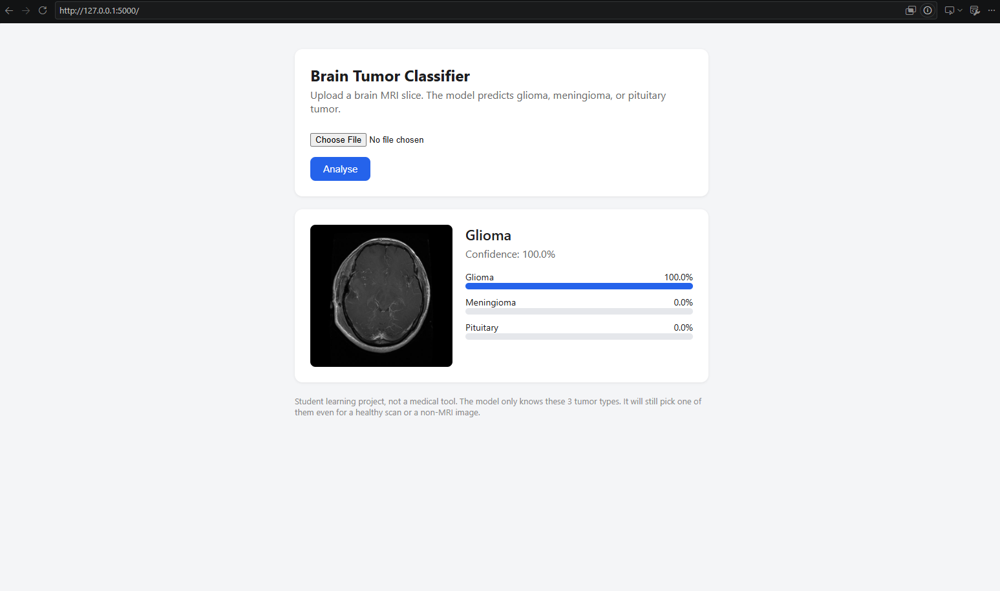
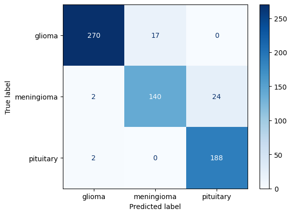

# Brain Tumor MRI Classification (ResNet50 + Flask)

Classifies brain MRI slices into **glioma**, **meningioma** or **pituitary** tumor using transfer learning with ResNet50, and serves predictions through a Flask web app.



## Results

| Evaluation | Test accuracy |
|---|---|
| Random image split (70/15/15) | **98.5%** |
| Patient-level split (no patient in both train and test) | **XX.X%** ← replace with your number |

**Why two numbers?** The dataset has 3,064 images from only 233 patients (~13 slices each). Neighbouring slices from the same patient look almost identical, so a random image split lets the model partly *recognise the patient* instead of the tumor (data leakage). The patient-level split uses the dataset's official `cvind.mat` folds and is the realistic estimate for unseen patients.



## Dataset

[Figshare brain tumor dataset](https://doi.org/10.6084/m9.figshare.1512427) by Jun Cheng: 3,064 T1-weighted contrast-enhanced MRI slices from 233 patients.

| Class | Images |
|---|---|
| Glioma | 1,426 |
| Meningioma | 708 |
| Pituitary | 930 |

The notebook downloads the data automatically and converts the MATLAB `.mat` files to `.jpg`. The dataset itself is not included in this repo.

## Method

- **Preprocessing:** resize to 224×224, ImageNet normalisation. Training images get augmentation (flips, ±15° rotation, brightness/contrast jitter).
- **Model:** ImageNet-pretrained ResNet50, final layer replaced with `Linear(2048→512) → ReLU → Dropout(0.5) → Linear(512→3)`.
- **Training:**
  1. Warm-up: 3 epochs, backbone frozen, only the new head trains (Adam, lr 1e-3).
  2. Fine-tuning: 15 epochs, whole network unfrozen (backbone lr 1e-4, head lr 1e-3), StepLR ×0.1 every 7 epochs.
  3. Best model chosen by validation accuracy.
- **Loss:** cross-entropy. **Batch size:** 32. **Hardware:** Google Colab T4 GPU.

## Project structure

```
├── brain_tumor_training.ipynb   # data download, preprocessing, training, evaluation
├── app.py                       # Flask web app
├── templates/index.html         # web page
├── requirements.txt
└── screenshots/
```

## Run the web app

1. Download `brain_tumor_model.pt` from the [Releases page](../../releases) and put it next to `app.py`.
2. Install and run:
   ```
   py -m pip install -r requirements.txt
   py app.py
   ```
3. Open http://127.0.0.1:5000 and upload an MRI image.

## Limitations

- **Not a medical tool.** This is a student learning project.
- The model only knows these 3 tumor types. It has no "no tumor" or "not an MRI" option, so it will always pick one of the three, even for unrelated images.
- It was trained on a single dataset from one source, so performance on scans from other hospitals or scanners is unknown.

## Credits

- Dataset: Cheng, J. et al. (2015). *Enhanced Performance of Brain Tumor Classification via Tumor Region Augmentation and Partition.* PLoS ONE 10(10): e0140381.
- Based on the project idea in [shsarv/Machine-Learning-Projects](https://github.com/shsarv/Machine-Learning-Projects/tree/main/BRAIN%20TUMOR%20DETECTION%20%5BEND%202%20END%5D). Rebuilt from scratch, with an added patient-level evaluation.
